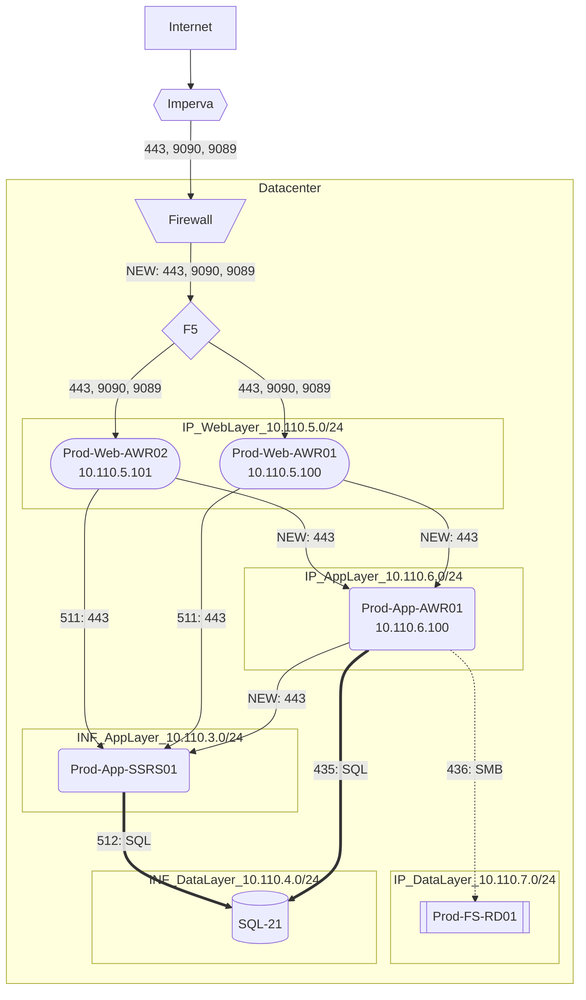

## Network Flow

```mermaid
flowchart TB
   subgraph Datacenter
      direction LR
      subgraph ipweb [IP_WebLayer_10.110.5.0/24]
         iw2([Prod-Web-AWR02 <br /> 10.110.5.101])
         iw1([Prod-Web-AWR01 <br /> 10.110.5.100]) 
      end
      subgraph ipapp [IP_AppLayer_10.110.6.0/24]
         ia1(Prod-App-AWR01 <br /> 10.110.6.100) 
      end
      subgraph ipdata [IP_DataLayer_10.110.7.0/24]
         ifsr[[Prod-FS-RD01]]
      end
      subgraph infapp[INF_AppLayer_10.110.3.0/24]
         issrs(Prod-App-SSRS01) 
      end
      subgraph infdata [INF_DataLayer_10.110.4.0/24]
         sql21[(SQL-21)]
      end

      fw1[\Firewall/] --> |NEW: 443, 9090, 9089| if5{F5} 
      if5 --> |443, 9090, 9089| iw1 & iw2
      iw1 & iw2 --> |NEW: 443| ia1
      ia1 --> |NEW: 443| issrs
      iw1 & iw2 --> |511: 443| issrs
%%    iw1 & iw2 -..-> |SMB| ifsr
      ia1 -..-> |436: SMB| ifsr 
      ia1 ==> |435: SQL| sql21
      issrs ==> |512: SQL| sql21
   end

   Internet --> imp{{Imperva}}
   imp --> |443, 9090, 9089| fw1
```  
^network_flow
## draw.io Overview

